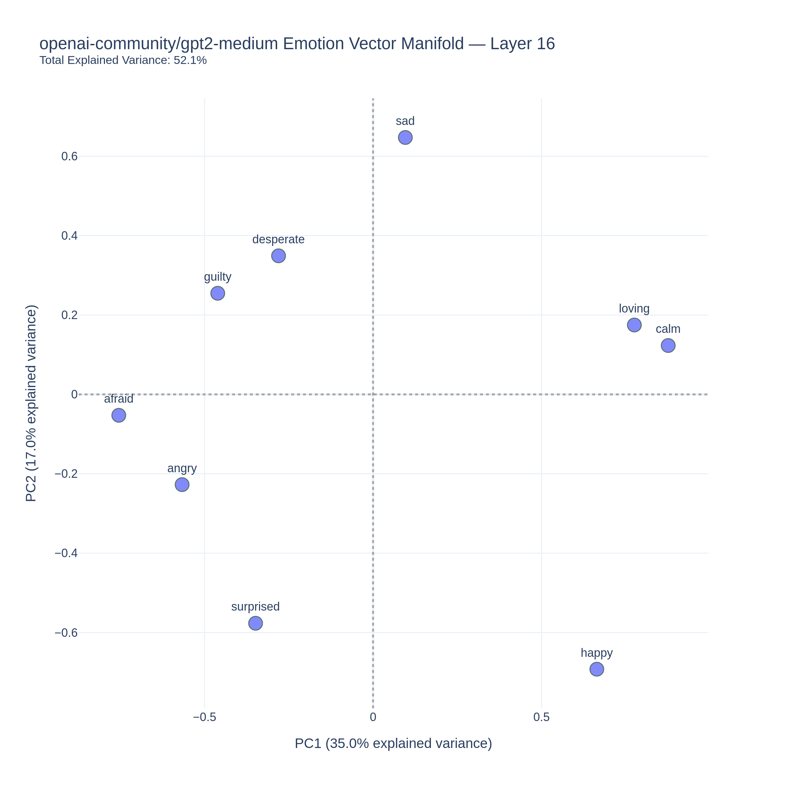
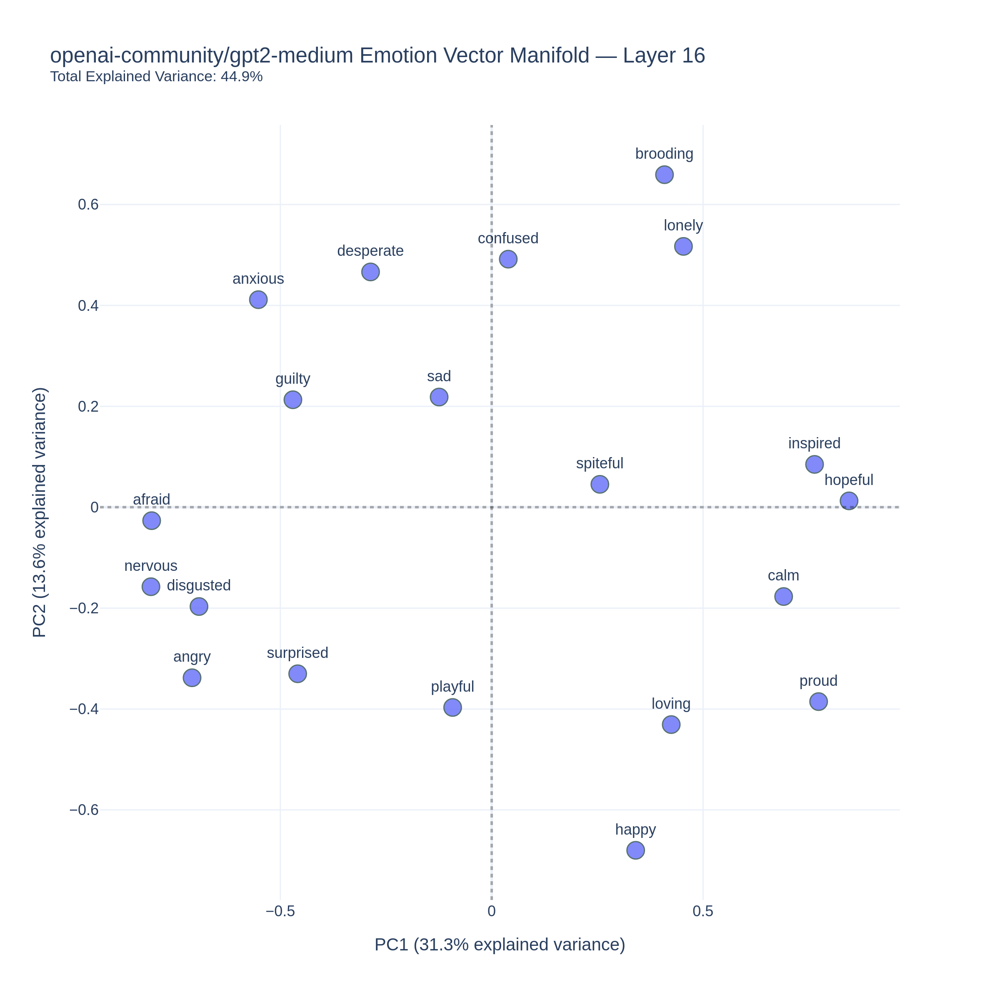
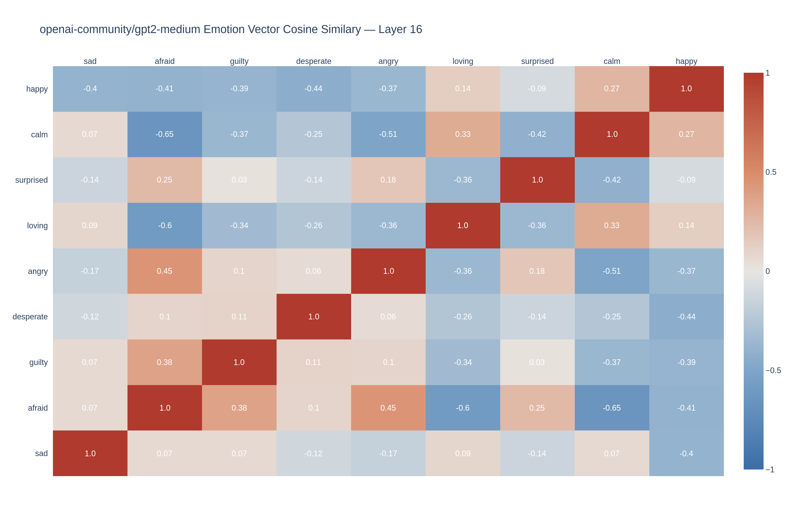
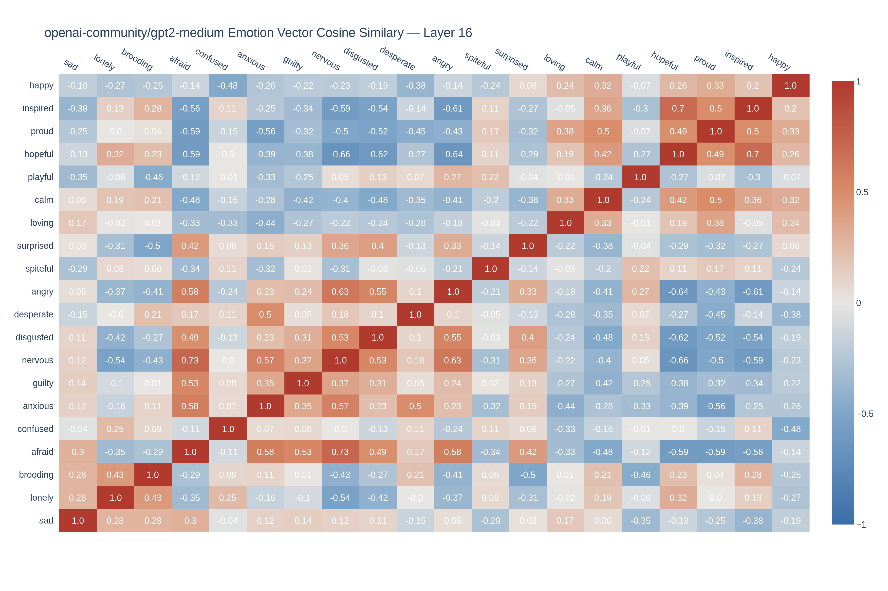
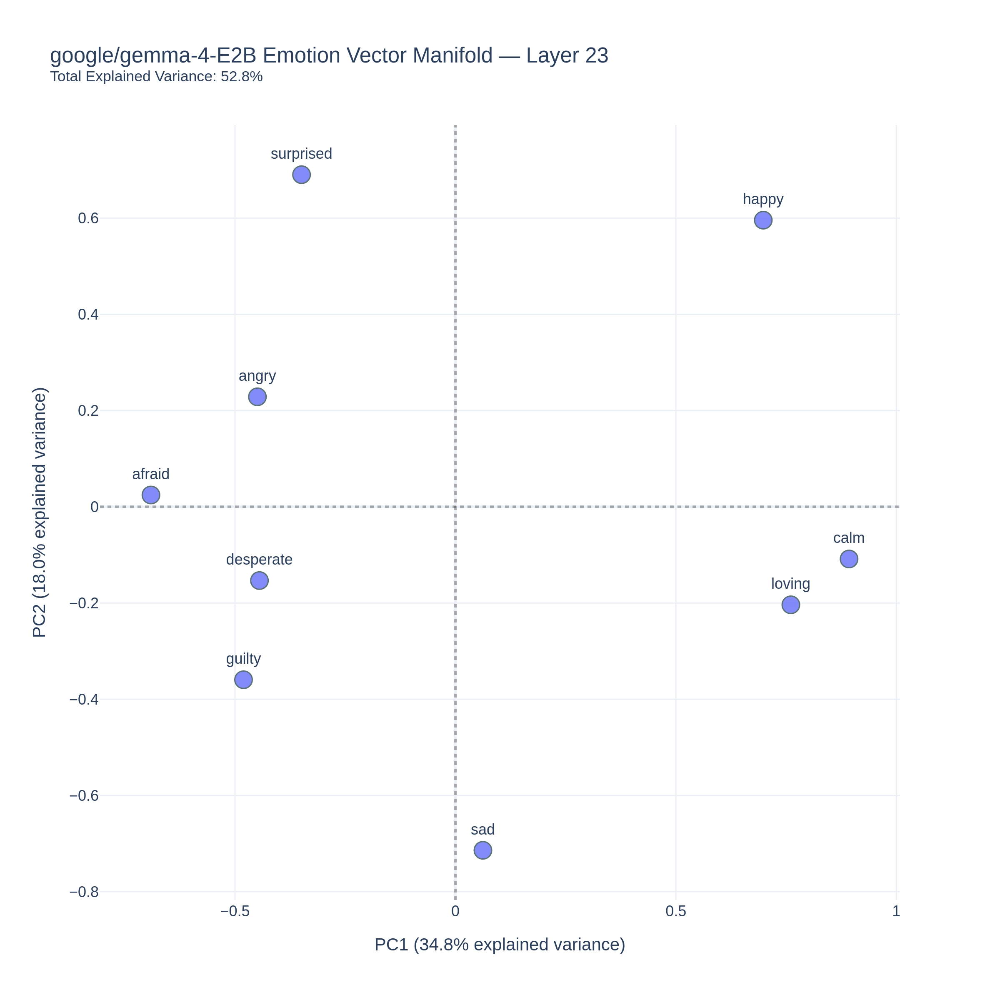
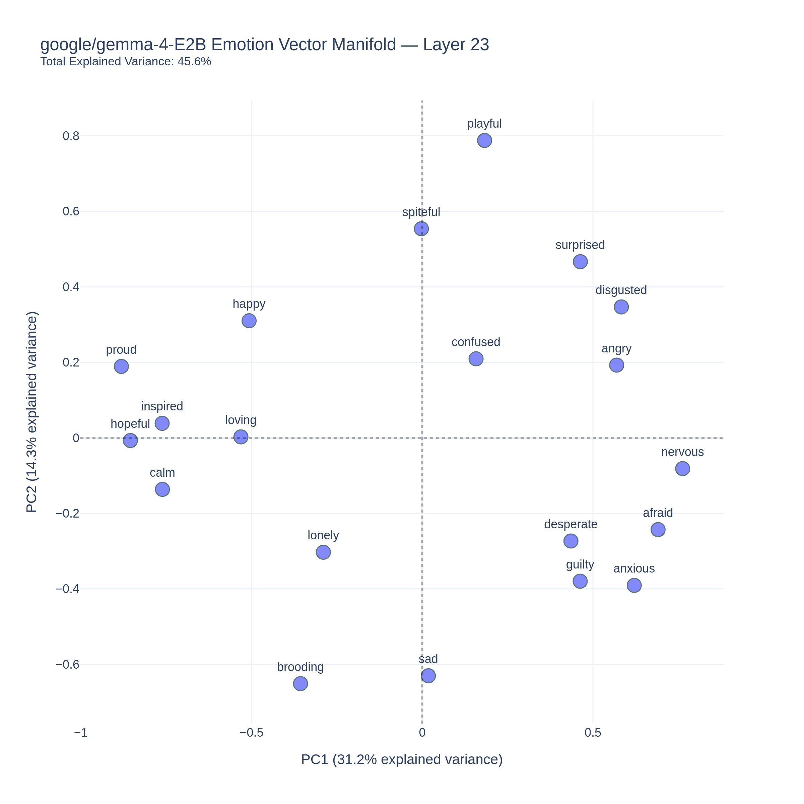
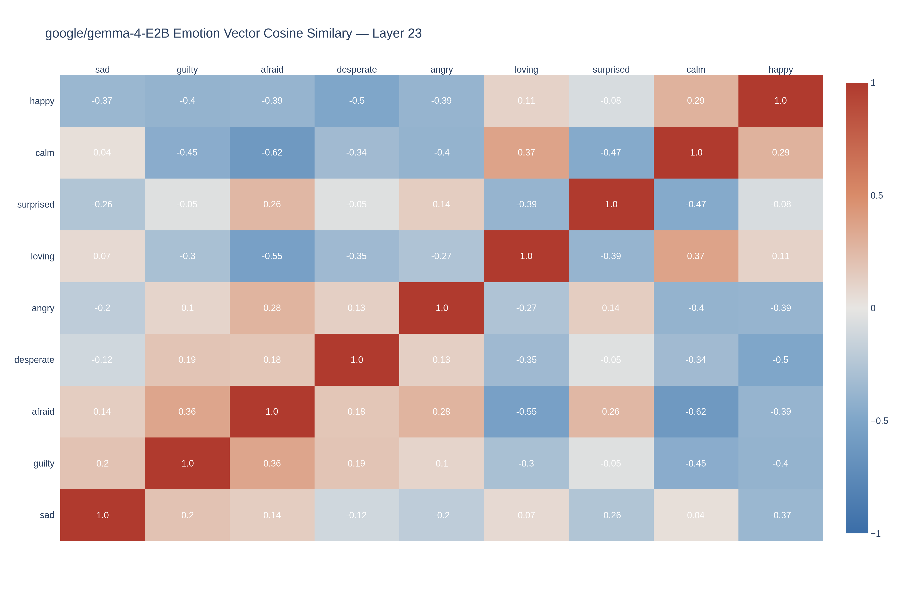
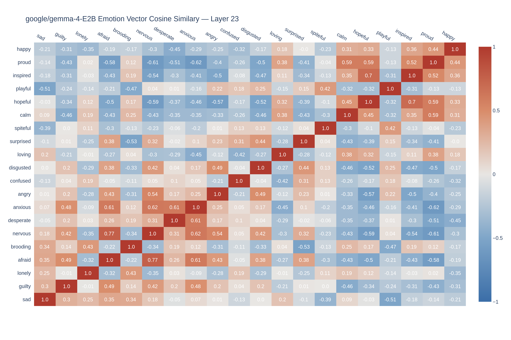

# EmotionVectorExtraction-Gemma4-GPT2

Partial replication of Anthropic's Emotion Vector findings using Gemma 4 E2B and GPT 2 Medium inside a Google Colab T4 Notebook

## Authors

- Abraham Jhared Flores Azcona _(NotsoJharedtrollOx17)_  ``abrahamjhared.flores@gmail.com``

## Abstract

We discuss the results obtained by replicating specific sections of Anthropic's Emotion Vectors. These particular sections encompass (i) PCA Valence/Arousal Projection, (ii) Emotion Vector Cosine Similarity, and (iii) Causal Effects of Emotion Vector Steering. Anthropic found that emotion vectors do affect reasoning and output of Claude Sonnet 4.5, an LLM developed by Anthropic. Their findings suggest that the semantic understanding of the model is comprised of the operative emotion vector, which is the vector currently processed by the model originating from the input prompt. These claims are partially supported by other non-academic replications using _meta-llama/Llama-3.3-70B-Instruct_ and _google/gemma-4-E2B_, although other models have not been used for replication attempts such as _openai-community/gpt-2-medium_ and _google/gemma-4-E2B_. Our contribution replicates (i), (ii), and (iii) using _openai-community/gpt-2-medium_ and _google/gemma-4-E2B_ inside a Google Colab environment. We found that (1) both models display an emergent Valence axis in the PCA plot, (2) both models display similarity clusters of related emotion vectors, and (3) _openai-community/gpt-2-medium_ displays greater steering sensitivity compared to _google/gemma-4-E2B_. Our findings suggest that emotion vectors _do emerge_ on antiquated LLMs such as _openai-community/gpt-2-medium_, and on modern offerings such as _google/gemma-4-E2B_. Furthermore, our findings about emotion vector steering  offer compelling evidence of their functional effects being present on models not related to the Claude family.

## Introduction

lorem ipsum dolor

## Methodology

It is crucial to emphasize our limited experimental scope. To further illustrate our scope, a summarization is provided on the table down below [Table 1].

| | **Anthropic [5]** | **Our Work** |
|---|---|---|
| **Model** | Claude Sonnet 4.5 | GPT 2 Medium and Gemma4-E2B |
| **Emotions tested** | 171 | 9 and 20 |
| **Stories generated** | 205,200 | 2000 |
| **Team** | ~16 researchers | 1 researcher + ChatGPT + Gemini |
| **Hardware** | Internal compute cluster | 2 Google Colab Notebooks with Free-Tier T4 NVIDIA GPUs |

**Table 1.** Experiment Scope Comparison of Anthropic [5] versus Ours. _Note:_ Inspired by a similar table found on [2].

Overall, we utilized the data pipeline found in [2] and then adapted the codebase to complement our data requirements and probing experiments. In a similar vein, we describe the methodology steps as follows: (1) Story Generation, (2) Emotion Vector Extraction, (3) Logit Lens, (4) Emotion Probe Steering, (5) PCA Projection, and (6) Cosine Similarity Heatmap. All steps are performed on both  _openai-community/gpt-2-medium_ and _google/gemma-4-E2B_.

### 1. Story Generation

We utilized a slight variation of the prompt template<sup>1</sup> utilized by [5], and then prompt the current web version of Gemini to generate batches of 10 stores per topic for each emotion with a JSON list format. Then we copy and paste the JSON into a file containing the stories generated for each emotion. This was decided to save the precious compute time provided in the free-tier range of our Google Colab Notebooks. We consider that story generation using the evaluated models would have slowed down our experiment execution. Likewise, we prompt Gemini with a neutral prompt<sup>2</sup> template to extend the list of texts consiting of commands and requests.

> <sup>1</sup> Full template prompt available at [`./research_data/PromptDataForEmotions.txt`](./research_data/PromptDataForEmotions.txt)

> <sup>2</sup> Full template prompt available at [`./research_data/PromptDataForNeutral`](./research_data/PromptDataForNeutral.txt)

### 2. Emotion Vector Extraction

Emotion vectors were computed by (1) averaging activations across all stories for a given emotion to obtain per-emotion mean vectors, (2) compute the global mean across all emotions, and (3) substract the global mean from each emotion mean. This process is executed for the list of 9 emotions, and for 20 emotions as well.

### 3. Logit Lens

Each emotion vector was projected through the model's unembedding matrix to verify it upweights semantically appropriate tokens. Said tokens were saved with their respective normalized standard deviation scores into JSON files utilized  on the next step. This process is done for the subset of 9, and 20 emotions respectively.

### 4 . Emotion Probe Steering

Utilizing the previously generated JSON logit lens files, we measure the difference of the log probability score between the steered tokens at +0.5 strength, and the baseline "emotion" tokens of the JSON file. We then project the scores into a heatmap. We execute two steering experiments with two different prompts, and display the steered text outputs to confirm the steering effects of our interventions. This process is executed for the list of 9, and 20 emotions respectively.

### 5. PCA Projection

We performed Principal Component Analysis on the emotion vector matrix to identify dominant organizational axes. This process is executed for the list of 9 emotions, and for 20 emotions as well.

### 6. Cosine Similarity Heatmap

We calculated and plotted pairwise cosine similarities between all emotion vectors to verify expected clustering and opposition patterns. This process is done for the subset of 9, and 20 emotions respectively.

## Results

The following subsection is further subdivided into two subsubsections: (1) GPT 2 Medium, and (2) Gemma 4 E2B. In summary, emotion vector extraction does work on both models and it captures the semantical understanding of each emotion tested, while emotion probing does affect the model outputs. For the sake of transparency, we provide inside ```./scripts/``` the Colab Notebooks containing all of results presented in this section.

### 1. GPT 2 Medium

| **Emotion** | **Top 5 Tokens** | **Bottom 5 Tokens** |
| :--- | :--- | :--- |
| ```sad``` | impover, stagn, alienation, blight, unaff | switch, saliva, gas, Immediately, palms |
| ```desperate``` | frantically, desperate, desperately, vain, vomit | enhancing, appreciation, enrichment, contrasted, showcased |
| ```guilty``` | Worse, unfairly, insulted, humiliated, disrespect | rhyth, illuminating, convergence, seamless, flourish |
| ```afraid``` | protr, violently, nervously, panic, coughing | empowerment, collaborative, unconditional, altru, enrichment |
| ```angry``` | angrily, fists, glared, glare, violently | nurturing, nurture, nurt, collaborative, beneficial |
| ```surprised``` | feasibility, paradigm, phenotype, isd, findings | breaths, slipping, clenched, phia, kisses |
| ```loving``` | nurturing, unconditional, friendship, nurture, nurt | panic, panicked, uddenly, scree, vom |
| ```calm``` | relaxation, breeze, relaxing, ambient, calming | Worse, stros, CHA, Worst, :( |
| ```happy``` | joyful, joy, ecstatic, exhilar, wonderful | Worse, complains, screws, inconvenient, offending |

**Table 2.** Top 5 and Bottom 5 Logit Lens Tokens for _openai-community/gpt-2-medium_ with 9 emotions.

| **Emotion** | **Top 5 Tokens** | **Bottom 5 Tokens** |
| :--- | :--- | :--- |
| ```sad``` | stagn, impover, alienation, blight, burdens | switch, tips, hot, Ready, Immediately |
| ```lonely``` | solitude, outsiders, Waiting, lonely, solitary | saliva, cheeks, muscles, tendon, juices |
| ```nervous``` | nerves, panic, fatigue, nausea, invol | beaut, kindred, Beaut, Beautiful, LOVE |
| ```brooding``` | looming, haunted, emptiness, haunting, melancholy | enthusi, udos, volunte, :-), congr |
| ```desperate``` | frantically, desperately, desperate, vain, frantic | enhancing, enrichment, socio, collaborative, societal |
| ```guilty``` | betrayed, humiliated, insulted, lied, Worse | convergence, seamless, flourish, collaborative, illumination |
| ```confused``` | incorrectly, Puzz, guessed, randomly, confused | pleasure, unparalleled, transformative, overcoming, resilience |
| ```anxious``` | nervously, panic, nausea, frantically, trem | collaborative, philanthrop, altru, collaboration, enrichment |
| ```spiteful``` | orem, derog, """, Honest, Fake | sensations, currents, rhyth, restless, consciousness |
| ```disgusted``` | stains, feces, stain, oily, slime | achievable, engagements, milestones, mastering, mastery |
| ```afraid``` | panic, protr, violently, tremb, trem | collaborative, collaboration, collaborations, empowerment, enrichment |
| ```angry``` | fists, angrily, glared, glare, violently | collaborative, collaborations, nurturing, achievable, partnerships |
| ```surprised``` | cedented, findings, phenomenon, phenomena, phenotype | slipping, needy, breaths, phia, breat |
| ```playful``` | zees, acky, rats, ftime, gee | emptiness, acutely, suppressed, anguish, oppressive |
| ```inspired``` | collaborative, collaborations, collabor, innovation, innovations | glared, nervously, glare, angrily, hairs |
| ```hopeful``` | sustainable, collaborative, achievable, sustainability, collaborations | angrily, vomit, awkwardly, glared, screamed |
| ```loving``` | nurturing, unconditional, friendship, kindness, nurt | Worse, ombat, vom, ungle, panic |
| ```proud``` | excellence, exceptional, philanthrop, cellence, accomplishments | panic, bage, dust, vomit, panicked |
| ```calm``` | breeze, relaxation, calming, calm, relaxing | Worse, CHA, stros, Worst, Illegal |
| ```happy``` | joy, joyful, exhilar, ecstatic, gratitude | complains, Worse, objectionable, inconvenient, offending |

**Table 3.** Top 5 and Bottom 5 Logit Lens Tokens for _openai-community/gpt-2-medium_ with 20 emotions.



**Figure 1.** PCA Projection Plot for _openai-community/gpt-2-medium_ with 9 emotions.



**Figure 1.** PCA Projection Plot for _openai-community/gpt-2-medium_ with 20 emotions.



**Figure 1.** Cosine Similarity Heatmap for _openai-community/gpt-2-medium_ with 9 emotions.



**Figure 1.** Cosine Similarity Heatmap for _openai-community/gpt-2-medium_ with 20 emotions.


**Figure 1.** Prompt00 Delta Log Probability Heatmap for _openai-community/gpt-2-medium_ with 9 emotions. _Note:_ Prompt00 is found in [./plots/emotion/logits/PromptID.txt](./plots/emotion_logits/PromptID.txt)


**Figure 1.** Prompt01 Delta Log Probability Heatmap for _openai-community/gpt-2-medium_ with 9 emotions. _Note:_ Prompt01 is found in [./plots/emotion/logits/PromptID.txt](./plots/emotion_logits/PromptID.txt)


**Figure 1.** Prompt00 Delta Log Probability Heatmap for _openai-community/gpt-2-medium_ with 20 emotions. _Note:_ Prompt00 is found in [./plots/emotion/logits/PromptID.txt](./plots/emotion_logits/PromptID.txt)


**Figure 1.** Prompt01 Delta Log Probability Heatmap for _openai-community/gpt-2-medium_ with 20 emotions. _Note:_ Prompt01 is found in [./plots/emotion/logits/PromptID.txt](./plots/emotion_logits/PromptID.txt)

### 2. Gemma 4 E2B



**Figure 1.** PCA Projection Plot for _google/gemma-4-E2B_ with 9 emotions.



**Figure 1.** PCA Projection Plot for _google/gemma-4-E2B_ with 20 emotions.



**Figure 1.** Cosine Similarity Heatmap _google/gemma-4-E2B_ with 9 emotions.



**Figure 1.** Cosine Similarity Heatmap _google/gemma-4-E2B_ with 20 emotions.


**Figure 1.** Prompt00 Delta Log Probability Heatmap for _google/gemma-4-E2B_ with 9 emotions. _Note:_ Prompt00 is found in [./plots/emotion/logits/PromptID.txt](./plots/emotion_logits/PromptID.txt)


**Figure 1.** Prompt01 Delta Log Probability Heatmap for _google/gemma-4-E2B_ with 9 emotions. _Note:_ Prompt01 is found in [./plots/emotion/logits/PromptID.txt](./plots/emotion_logits/PromptID.txt)


**Figure 1.** Prompt00 Delta Log Probability Heatmap for _google/gemma-4-E2B_ with 20 emotions. _Note:_ Prompt00 is found in [./plots/emotion/logits/PromptID.txt](./plots/emotion_logits/PromptID.txt)


**Figure 1.** Prompt01 Delta Log Probability Heatmap for _google/gemma-4-E2B_ with 20 emotions. _Note:_ Prompt01 is found in [./plots/emotion/logits/PromptID.txt](./plots/emotion_logits/PromptID.txt)

## Discussion

Our results provide substantial evidence that emotion vectors can be extracted from various generations of LLMs. It is particularly interesting that a similar methodology used by [2] obtained the presented evidence. The multi-language nature of our extracted "emotion" logit lens found in _google/gemma-4-E2B_ is concondart to the logit lens found in [2], which utilized _google/gemma-4-E4B_. Aditionally, the multilingual nature of emotion vectors emerges on modern models such as _meta-llama/Llama-3.3-70B-Instruct_, which is reported by [1]. In constrast, the multilingual property does not appear on our findings for _openai-community/gpt-2-medium_.

Regarding our PCA projections, their similarities and differences may be attributed to the low sample counts of emotion stories used, in addition to
extracting the emotions vectors from a set of only 9, and 20, emotions. Utilizing 9 emotions for the "emotion" PCA plot of both _openai-community/gpt-2-medium_ and _google/gemma-4-E2B_ illustrates that PC1 captures an emergent "Valence" axis. This pattern also appears with greater strength on the projection utilizing 20 emotions. Our particular finding is that an inverted "Valence" axis arises on the projections of _google/gemma-4-E2B_, which is supported further by the evidence collected on [2]. We argue that the PCA projections of _google/gemma-4-E2B_ are crucial evidence that an "emotion" manifold may not replicate the axis orientation presented on the psychological construct mentioned in [5], suggesting that emotion vectors may capture an inherently different geometry depending on the model family, such as the Gemma 4 family. We must remark that our previous claim is favored by a discussion thread found on HuggingFace<sup>1</sup>, which argues that a greater story sample count, and a larger emotion list, generates similar results to the ones reported by ourselves and [2].

The cosine similiarity heatmaps for both _openai-community/gpt-2-medium_ and _google/gemma-4-E2B_ display related emotion clusters even with a list of 9 emotions. The clustering effect is more pronounced with our list of 20 emotions, where emotions such as ```"calm"```, ```"loving"```, and ```"happy"``` have noticeable red/orange colorings between each other. This clustering heatmap effect is concordant to the results reported by [1][2][5]. The similarity heatmaps appear to follow a similiar grouping effect displayed on the PCA plots discussed previously. 

Finally, our results from the emotion steering experiments strengthen the claim of [5] that emotion vectors causally influence the model's outputs. To our knowledge, the replication of [1] is the only existing attempt at the steering effects. While they collected vast amounts of evidence, there are not any plots similar to the steering heatmaps found in the Appendix of [5]. We believe that our replication attempt of the aformentioned heatmaps facilitates the understanding of the interventions done in _openai-community/gpt-2-medium_ and _google/gemma-4-E2B_. The heatmap for _openai-community/gpt-2-medium_ displays that matches of steered vectors with their respective token sets (e.g. ```"happy", [joyful, joy, ecstatic, ...]```) do augment their likelyhood from the baseline response. In particular, _openai-community/gpt-2-medium_ seems to have sparse likelihood activations of related emotions. We can assume that the model is not as capable at discerning the most appropiate token set to activate in accordance to the requested prompt, which is supported by the baseline (unsteered) generated text from the input prompt. What is interesting is that the generated text from a particular steering intervention seems to capture the semantical concept of the steered emotion. 

In a similar vein, our steering results for _google/gemma-4-E2B_ suggest that the model can handle the input prompt of the intervention with greater ease, and steering augments the likelihood of most matches with moderate strenght. The baseline generated text response handles the request with no signs of broken text behaviour like _openai-community/gpt-2-medium_, and that steered text generations semantically reflect the desired emotion. One particular highlight is that our steering heatmap of 20 emotions shows that ```"disgusted"``` deactivates all tokens sets. Further research is required to explain why that is the case.

Overall, our partial findings support the claims of [5], and it is remarkable to highlight their achieved replicability on models not related to the Claude family. Although our results may be interpreted as solid evidence, we must express caution and skepticism because our limited methodology scope might have altered the presented structures in terms of fidelity and resolution.

> <sup>1</sup> [HuggingFace thread](https://huggingface.co/google/gemma-4-E4B-it/discussions/8).

## Conclusion

__The described findings suggest that emotion vectors can be extracted from _openai-community/gpt-2-medium_ and _google/gemma-4-E2B_, and can causally influence their responses if steered with the aformentioned vectors.__ This is supported by other replications accomplished by the online enthusiast community. Albeit antiquated for modern standards, _openai-community/gpt-2-medium_ displays an emergence of the described vectors and strong steering effects when intervened with them. In constrast, _google/gemma-4-E2B_ has moderate steering strength. In conclusion, we can ascertain that emotion vectors are present on models not related to the Claude family, and the results found for Claude Sonnet 4.5 can be replicated with noticeable similarity. __We argue that emotion vectors may be a fundamental property of large language models, and their causal steering effects might facilitate the understanding of their decision-making.__ We encourage academics, professionals, and hobbyists alike to advance this line of research that may uncover additional properties than the ones documented on the current writing.

## License

MIT License

## Acknowledgment of AI Usage
We hereby state that both ChatGPT and Gemini were utilized for the analysis, interpretation, and code development of the data pipeline. In particular, ChatGPT<sup>1</sup> facilitated the comprehension and further augmentation of the emotion probe codebase found in [2], while Gemini<sup>2</sup> assisted in the initial understanding of the emotion vector publication [5], including the emotion story generation.

> <sup>1</sup> Full conversation available at [`./research_data/conversationChatGPT-Emotion-Mapping-Framework.md`](https://github.com/NotsoJharedtrollOx17/EmotionVectorExtraction-Gemma4-GPT2/blob/main/research_data/conversationChatGPT-Emotion-Mapping-Framework.md)

> <sup>2</sup> Full conversation available at [`./research_data/conversationGemini-Replicating-Emotion-Vectors-in-LLMs.md`](https://github.com/NotsoJharedtrollOx17/EmotionVectorExtraction-Gemma4-GPT2/blob/main/research_data/conversationGemini-Replicating-Emotion-Vectors-in-LLMs.md)

## Citation

```
@misc{
    flores2026emotionvectorreplication,
    title = {Partial Replication of Anthropic's Emotion Vectors using Gemma 4 E2B and GPT 2 Medium inside a Google Colab T4 Notebook},
    author = {Flores A., Abraham J.},
    year = {2026},
    month = {May},
    url = {https://github.com/NotsoJharedtrollOx17/EmotionVectorExtraction-Gemma4-GPT2/tree/main},
    note = {This replication is the first independent replication of Anthropic's Emotion Vectors utilizing GPT 2 Medium}
}
```

## References

[1] ewernn, “traininterp,” 2026, Available: https://github.com/ewernn/traitinterp

[2] Y. Hsieh, “Replicating Anthropic’s Emotion Vectors on OpenSource Models: Evidence from Gemma4E4B,” 2026, Available: https://huggingface.co/rain1955/emotionvectorreplication

[3] A. Radford et al., “Language models are unsupervised multitask learners,” OpenAI blog, vol. 1, no. 8, p. 9, 2019.

[4] Google Deepmind, “Gemma 4 Model Card,” 2026, Available: https://ai.google.dev/gemma/docs/core/model_card_4

[5] N. Sofroniew et al., “Emotion Concepts and their Function in a Large Language Model,” Transformer Circuits Thread, 2026, Available: https://transformercircuits.pub/2026/emotions/index.html

[6] Anthropic, “System Card: Claude Sonnet 4.5,” 2025, Available: https://www.anthropic.com/claudesonnet45systemcard